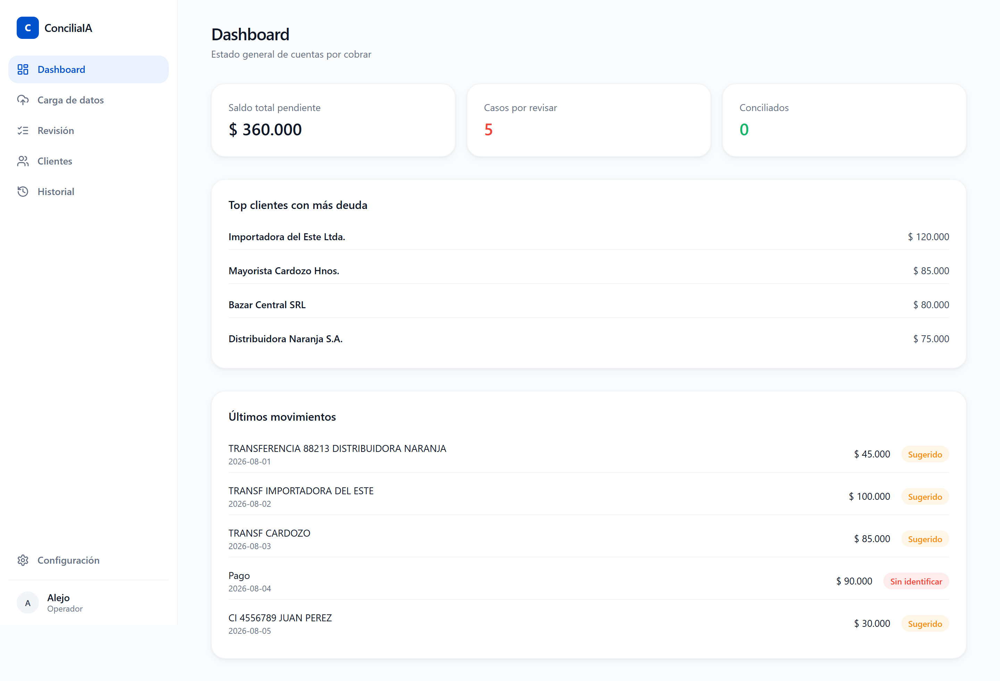
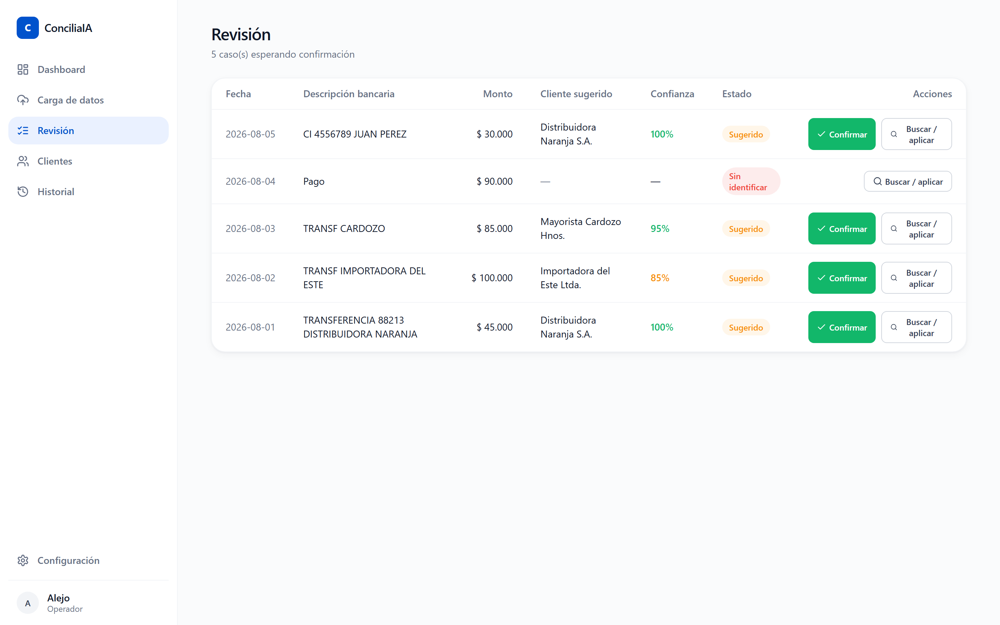
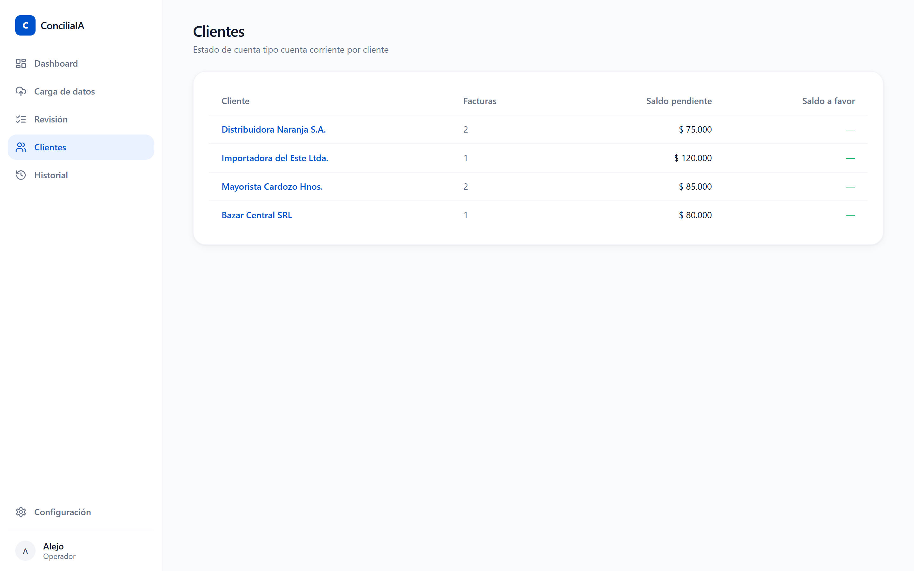
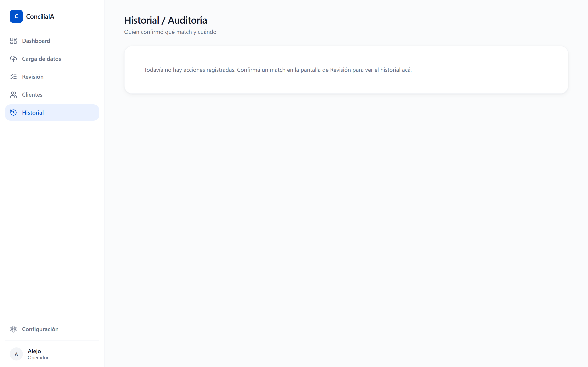
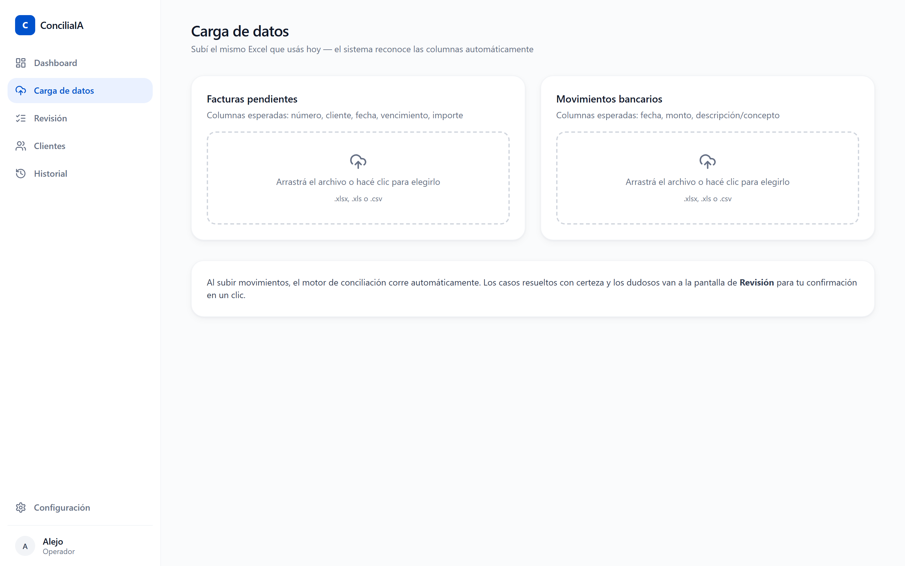
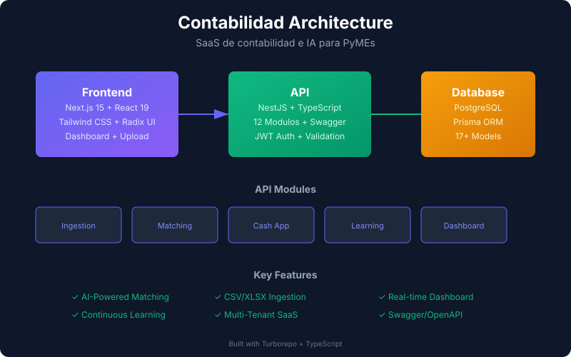

# Contabilia 💰

> Plataforma SaaS de contabilia e IA para estudios contables y PyMEs: ingesta de datos, conciliación automática, aplicación de pagos y aprendizaje continuo.

[](https://github.com/Fernandezalejo1/contabilia/actions/workflows/ci.yml)
[](https://opensource.org/licenses/MIT)
[](https://www.typescriptlang.org/)
[](https://nestjs.com/)
[](https://nextjs.org/)
[](https://www.prisma.io/)

---

Contabilia es un **monorepo** (Turborepo) que combina una **API NestJS** de conciliación contable con inteligencia artificial y una **web Next.js** de gestión. El sistema ingiere extractos bancarios y facturas, cruza movimientos contra pagos usando reglas + embeddings, y **aprende de cada confirmación** del usuario para afinar los cruces futuros.

## 📸 Capturas de pantalla







## 🏗️ Arquitectura del monorepo



```
contabilia/
├── apps/
│   ├── api/               # API NestJS (conciliación, ingesta, IA)
│   └── web/               # Frontend Next.js (dashboard, revisión de cruces)
├── packages/
│   ├── database/          # Prisma schema + client + seeds
│   └── shared-types/      # Tipos TypeScript compartidos
├── docs/                  # 9 documentos de diseño (arquitectura → PRD)
├── scripts/               # Utilidades
└── turbo.json             # Orquestación de tareas
```

## ✨ Funcionalidades

- **Ingesta de datos**: CSV de bancos y facturas, normalizados automáticamente.
- **Motor de conciliación**: reglas + similitud semántica (embeddings) + **alias aprendidos**.
- **Cash application**: aplica pagos a facturas, con soporte de pagos parciales y múltiples.
- **Aprendizaje continuo**: cada cruce confirmado/corregido realimenta el modelo de alias.
- **Módulos de la API**: ingestion, matching, cash application, learning, dashboard.
- **9 documentos de diseño** en `docs/`: arquitectura, modelo de datos, API, PRD completo.

## 🧱 Stack

| Capa | Tecnología |
|---|---|
| API | NestJS, TypeScript, Prisma |
| Web | Next.js, React, Tailwind |
| DB | PostgreSQL / SQLite (dev) |
| IA | Embeddings + similitud de texto |
| Tooling | Turborepo, TypeScript estricto, Prettier |

## 🚀 Cómo ejecutar

```bash
npm install                 # instala todos los workspaces
npm run db:generate         # genera el cliente Prisma
npm run db:migrate          # aplica migraciones
npm run db:seed             # datos de ejemplo
npm run dev                 # levanta API + web (turbo dev)
```

Variables de entorno necesarias (ver `.env.example` en la raíz y en `packages/database`):

```
DATABASE_URL=postgresql://...
OPENAI_API_KEY=            # opcional, para embeddings/IA
ANTHROPIC_API_KEY=         # opcional
NEXT_PUBLIC_API_URL=http://localhost:3001
PORT=3001
```

## 🔒 Seguridad

- **CORS configurado** — Orígenes permitidos vía variable de entorno
- **Validación global** — Whitelist + forbidNonWhitelisted en pipes
- **Contraseñas hasheadas** — PBKDF2 con salt único por usuario
- **JWT tokens** — Autenticación stateless con expiración configurable
- **Multi-tenant** — Aislamiento completo por organización
- **Audit logs** — Toda acción queda registrada

Ver [SECURITY.md](SECURITY.md) para reportar vulnerabilidades.

## 📚 API Documentation

La documentación Swagger/OpenAPI está disponible al ejecutar el servidor:

```
http://localhost:3001/docs
```

Incluye todos los endpoints documentados, modelos de datos y ejemplos de uso.

## 🚀 Deploy

Ver [DEPLOY.md](DEPLOY.md) para guías de deploy (Docker, Railway, Vercel, Render).
## 🤝 Contribuir

Ver [CONTRIBUTING.md](CONTRIBUTING.md) para guías de desarrollo.

## 📄 Licencia

MIT © 2026 Alejo Fernandez
